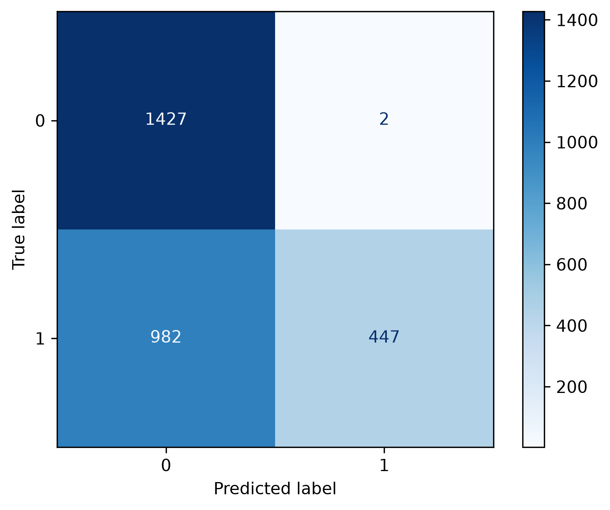
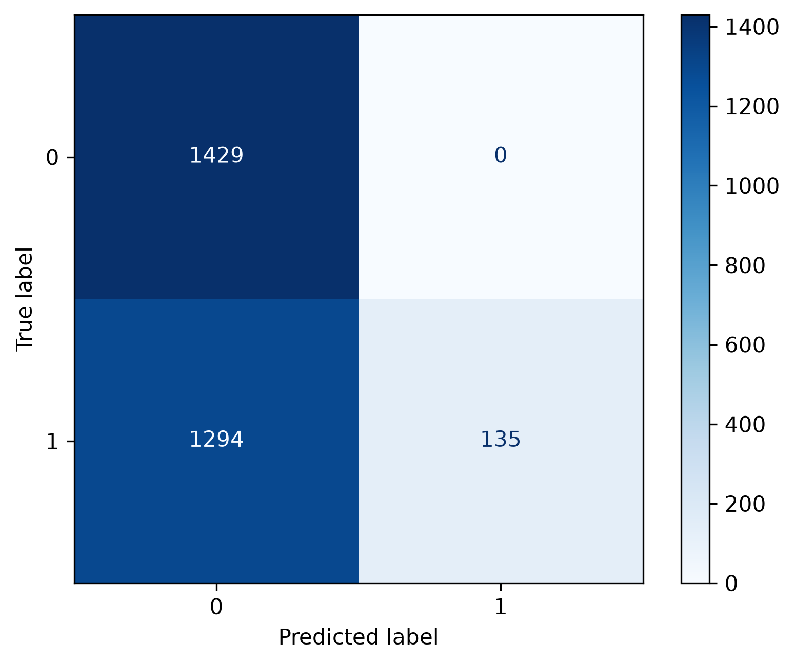

# Building a baseline classification model for phishing url detection

The task was to develop a traditional machine learning model that for a given URL detects if it is phishing (positive label, 1) or legitimate (negative label, 0). For such task the following decisions had to be made:
* which model to try
* what features to calculate
* how to preprocess the data before feature calculation
* feature selection (if needed)
* selecting a decision threshold

For such tasks (binary classification on textual samples) my usual go-to model is logistic regression with TF-IDF vectorization. Here each sample is a single word (a url), so character-based $n$-gram tokenization is the obvious choice. The plan is the following.

For each url we count the occurrences of (2, 3, 4)-grams hoping that such short consecutive characters describe patterns that occur frequently in one class, but not in the other. These occurrences then adjusted with the occurrences of those patterns in the whole dataset, so we expect that patterns occuring in most of the urls do not have discriminating power. The counts are then normalized, so each url is converted to a vector of length 1 where each position we have the weighted count of a given 2-, 3- or 4-gram. Such vectors are usually long ones, but they provide a sparse representation of a url. This is typical in text-related problems and that does not cause any issues with a logistic regression. Feature selection is not needed, but we can tweak if we would like to have an upper limit for the number of features or a minimum count for an $n$-gram.

## (1) Data quality and preprocessing

* There were $50$ urls in the dataset that have conflicting labels, so they appeared twice with different labels. Since I did not know which one is true, I decided to remove them completly as such examples would confuse any models.
* After the removal of these, I still had additional duplicates, at least with the same label. I have removed the duplicates. What left is a balanced data set containing `8521` training examples.
* Investigating the `length` distribution it turned out that phishing urls are tend to be longer and around `25%` of them has query parameters in the url. This is much rare among normal urls, so I decided to keep that part as it might have a discriminating power.
* There can be several ways to clean a url like removal of some parts, truncating it, replacing non-ASCII characters with an `<UNK>` symbol, identifying near duplicates, etc, but due to the time constraint, I made the following decision:
    * remove scheme, but keep query part
    * do not truncate
    * keep international addresses that include non-ASCII characters. Unicode normalization might provide better results but that can also remove discriminative power and due to time contraints I let them as is.
    * because of this I replaced escapes with their single-character equivalent, so I converted precent-encoded strings to their unicode-equivalent single character representation.

## (2) Building a model

I used an 80-20 train-test split. Since I want to determine the "best" threshold, I would need a separate validation set. So instead of the split above, we could do a 60-20-20 split or similar, then training a model on `60%` of the data, determining the threshold using the `20%` validation set and finally evaluating the model on the `20%` test set. This is viable, but we lose `20%` data from the training set, which is painful considering the small amount of data we have. 

Instead, we could do a 80-20 split and use $5$-fold cross-validation to obtain scores of the training examples where each sample is evaluated by a model that is not trained on that sample. These scores then can be used for determining the threshold since none of them were seen by the model(s).

This is what I have done: by using $5$-fold randomized cross-validation I trained 5 different models and evaluated all samples in the training data by a model that did not see that particular sample.

## (3) Selecting the threshold

My first attempt was a bit clumsy. I selected the threshold that maximizes the $F1$-score which combines precision and recall into a single number and also works for imbalanced classes.

```text
AUC: 0.966
Best threshold: 0.46317
Precision: 0.88237
Recall: 0.92143
FPR: 0.1231
```

AUC measures how well the model can separate the two clasess. What we can see here is that the model is reasonably good, the threshold is around $0.46$. The problem is that, as it turned our later in the instructions, the prevalence of the positive class does not match with the positive/negative ratio I have in my data. It is $1:1$ in the trainign data and $1:1000$ in real life. 

Here for the negative examples, 12% of them are classified as phishing url. This means that if we have $100000$ real-life examples, $99900$ examples would be normal examples, but $~12000$ would be flagged as phishing. Precision would be very bad and the high number of false alarms would make the product unusable. A $0.123$ FPR is unacceptable in the real-life scenario.

So I made an adjustment, I have weighted the samples according to their prevalence in real-life and calculated the $F1$-scores that way.
```text
AUC: 0.966
Best threshold: 0.85946
Precision (estimated by using real-world prevalence): 0.47900
Precision (using the data I have): 0.9989
Recall (estimated by using real-world prevalence): 0.27001
Recall (using the data I have): 0.27001 
FPR: 0.00029
```

This is much better: the threshold is way higher, the precision and recall is lower, but the detector does not fire too frequently as `FPR` is low. Note that recall is not affected by prevalence as it only considers the positive population and changing how many negatives exist does not change this ratio. 

This is also not the best way to get a good threshold. The following would help: fix a desireable `FPR`, adjust precison with the prevalence and select that threshold where the `FPR` dos not exceed the selected limit and has the highest recall.

Anyway, this time the selected threshold remained $\tau = 0.85946$.

## (4) Evaluating the model on the test set

```
             precision    recall  f1-score   support

           0      0.604     1.000     0.753       852
           1      1.000     0.346     0.514       853
```

This is the result of evaluation, without weights / prevalence adjustment. I did not have to work out the details between the evaluation on the data I had and the expected behavior in real-life. So in the toy test data I had an overly optimistic $1.00$ precision and a `34.6%` recall and a good `AUC = 0.976`.

## (5) Evaluating on the independent datasets 

I got similar results for the data in `test.csv`:
```text
              precision    recall  f1-score   support

           0      0.592     0.999     0.744      1429
           1      0.996     0.313     0.476      1429
```
with `AUC` is still $0.97$.



However, the external dataset is different.

```text
              precision    recall  f1-score   support

           0      0.525     1.000     0.688      1429
           1      1.000     0.094     0.173      1429
```




`AUC` is down to $0.86$ and most of the positive examples remain undetected. The reason for that is possible data distribution differences, that is, during training the model never seen examples that were similar to the phishing examples present in this external data file.

To sum up, we ended up with a model that has a good `AUC`, it has an estimated precision of $0.48$ in real-world scenario with $0.27$ recall, however, it is trained on a small dataset and performs poorly on one of the unseen data, basically leaving a large number of phishing urls undetected, but at least the false positve rate remains low. To fix the issue, I would do the following steps:
* collect more data
* do better preprocessing using domain knowledge
* the threshold selection should be based on real-life prevalence (I have not finished it properly)
* the reported metrics should estimate their real-life values and not the actual values achieved on artifical data (the matrics on the test data itself are overly optimistic)
* The final model has a low false positive rate, but approximately half of its detection is wrong. FPR is small, but only because we have lots of negative examples compared to the positive ones. I would further decrease the desired FPR, to, let's say $0.0001$. In my notebook one can see that for such value we can have `threshold=0.897, recall=0.167, fp_rate=0.000000, precision=1.000`, so slightly higher threshold would result in better real-life precision (although not `100%` for sure at the expense of a $0.167$ recall. Not sure what the business decision is, but I think false positives kill the product, meanwhile, detecting only $1$ phishing out of $6$ is not great either. I would do incremental improvements (better preprocessing, more data, better model) and then deploy it.


```python

```
